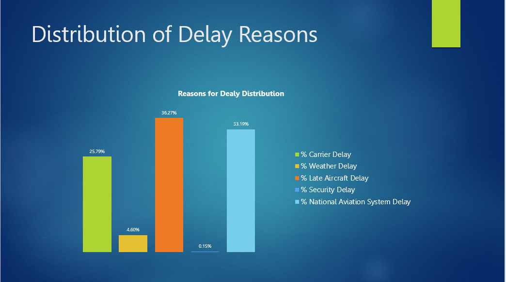

# Introduction:
 
In this project, I was provided with a data set of airports delays records containing more than 20 columns and more than 4200 records. 
I was instructed to provide recommendations for the CEO/management of an airline in term of the potential delays the airline may encounter.
I had submitted this task using MS Excel, however, yesterday, I redid it using MS Power BI to showcase my skills in both softwares.

