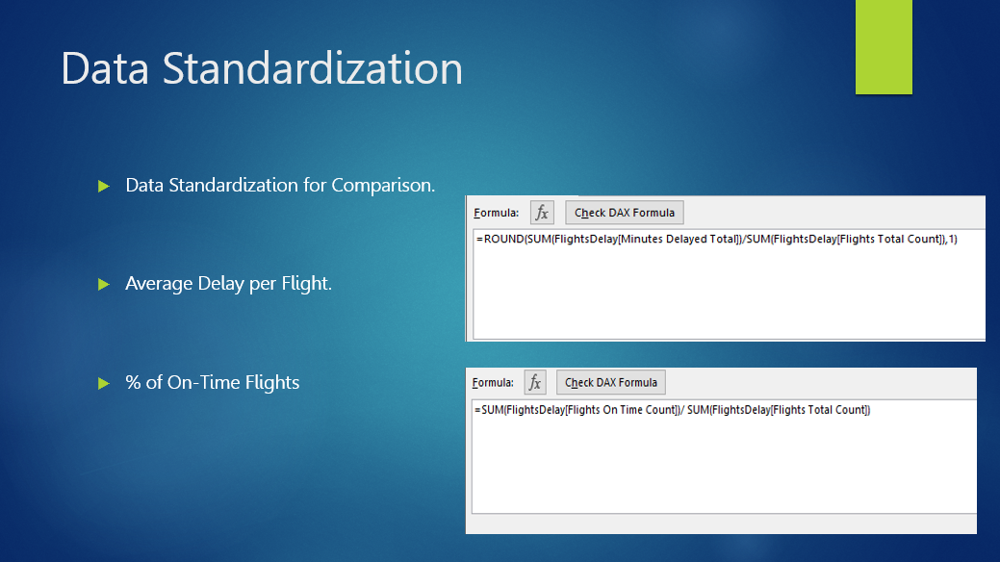
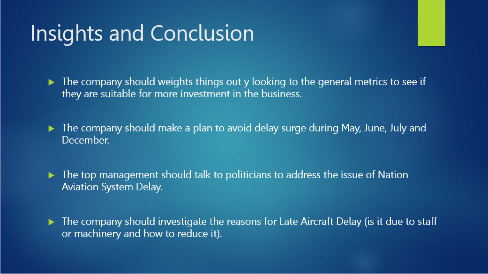

# Introduction:
I had applied for a data analyst position in one of the largest startup companies in the Gulf. Afterward, I received an email from them with a document and test instructions to prove my skills as a data analyst. The test consisted of 3 parts through which I used MS Excel, MS Power BI and Tableau. I cleared the 3 tasks, however, it turned out that the job was only for the citizens (I am not a citizen).  I thanks them for their warm email, and wish them good luck (even though I wasn't hired, I had the chance to do these nice projects). This project is the second part of their assessment test.

  
In this project, I was provided with a data set of airports delays records containing more than 20 columns and more than 4200 records. 
I was instructed to provide recommendations for the CEO/management of an airline in term of the potential delays the airline may encounter.
I had submitted this task using MS Excel, however, yesterday, I redid it using MS Power BI to showcase my skills in both softwares.

