# COVID Data Analysis:
## Intro:
Months ago, I had applied for for a data analyst position in one of the largest startup companies in the Gulf. Afterward, I received an email from them with a test instructions to prove my skills as a data analyst. The test consisted of 3 parts through which I used MS Excel, MS Power BI and Tableau. This project is the first part of the test.

In this project, I was given a dataset of COVID infections in multiple countries and was instructed to show which countries have done better over time. The requirement was to use 1 tool for the analysis, however, I performed the task and built a dashboard in Excel, Power BI and Tableau to show my skills in the 3 softwares.

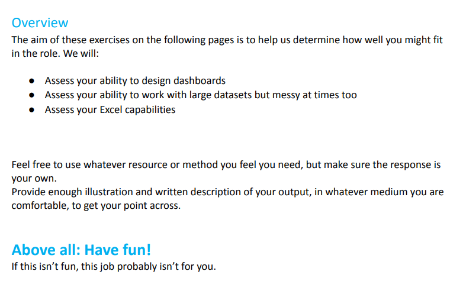

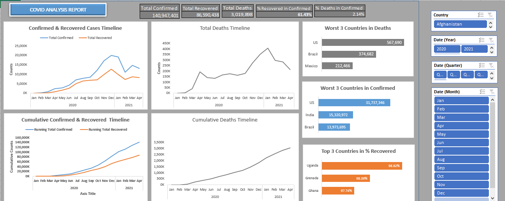
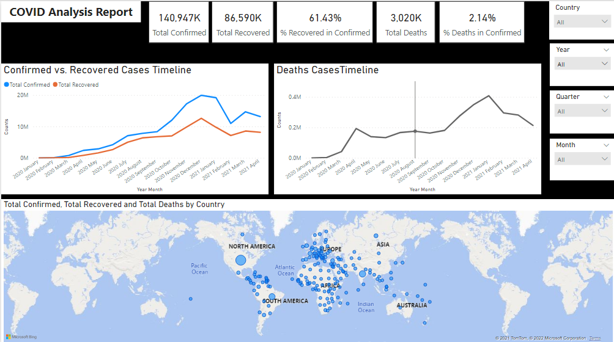
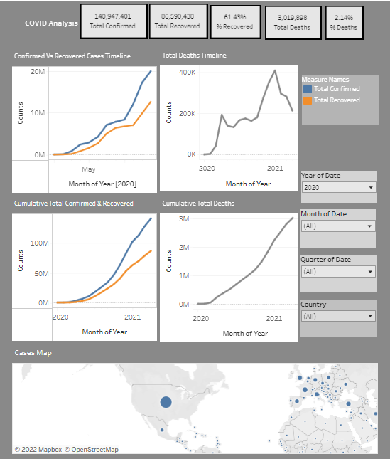

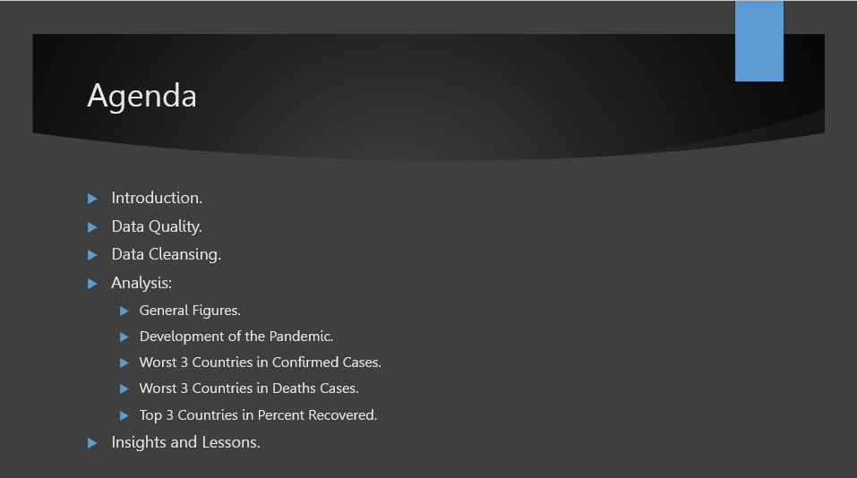
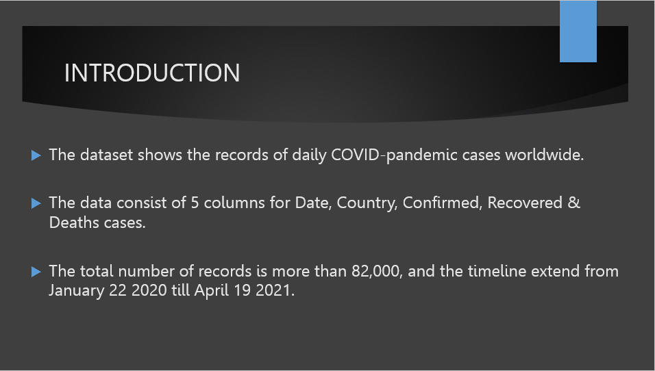

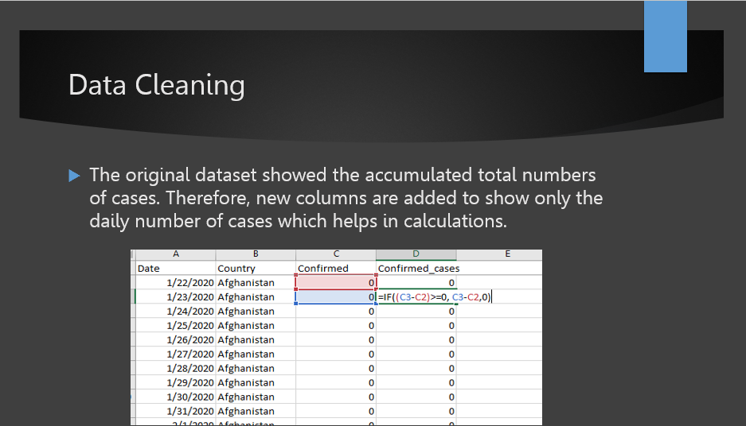

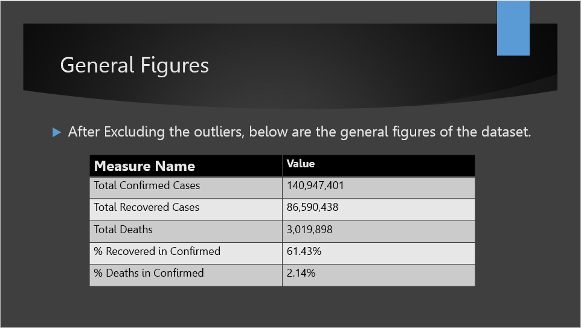
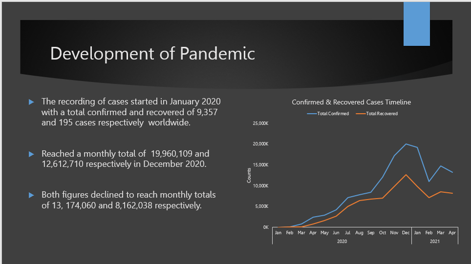
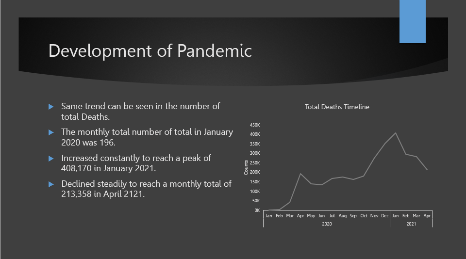

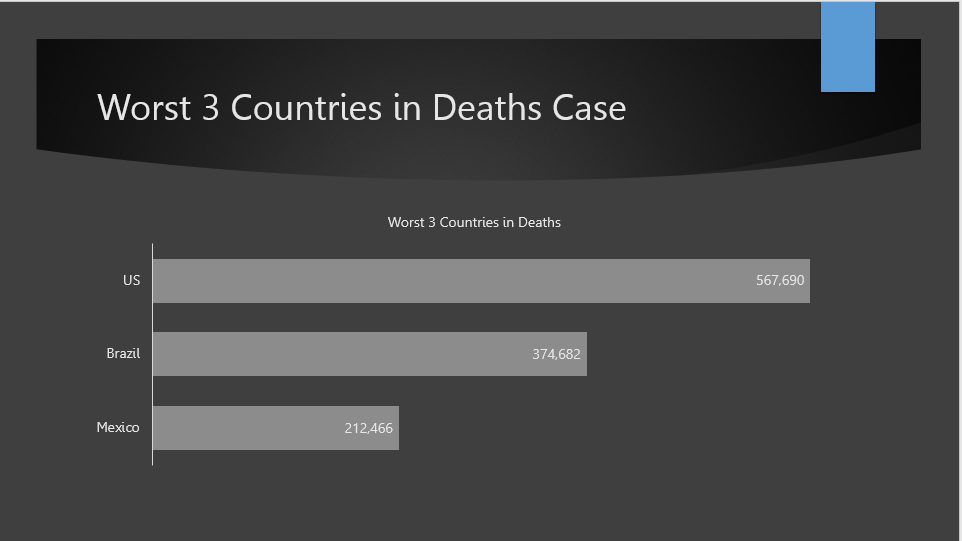

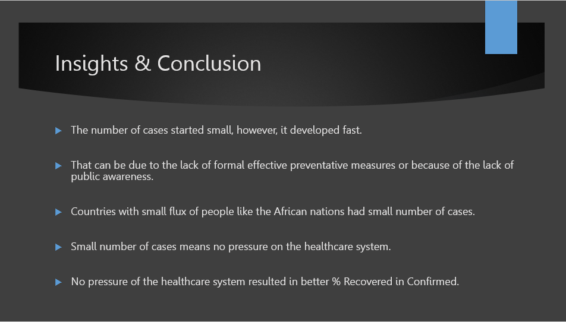
