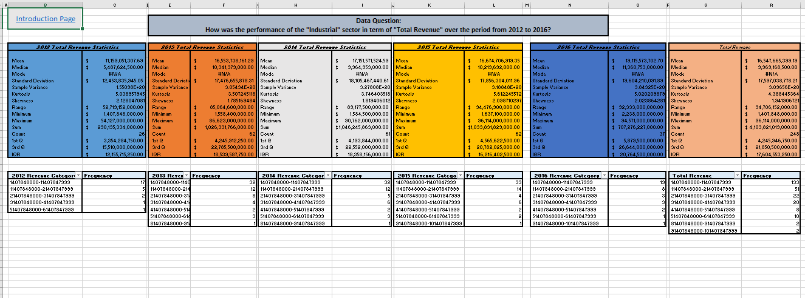
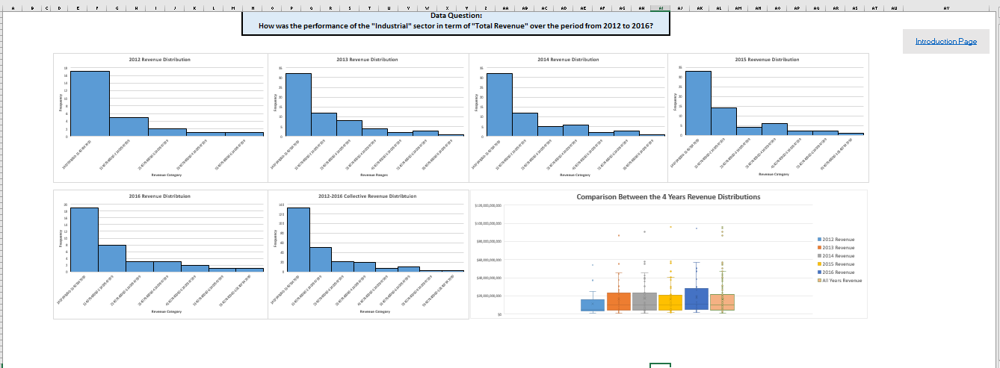
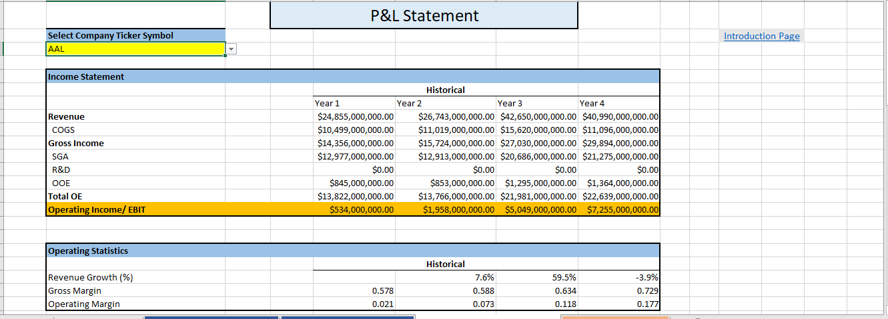
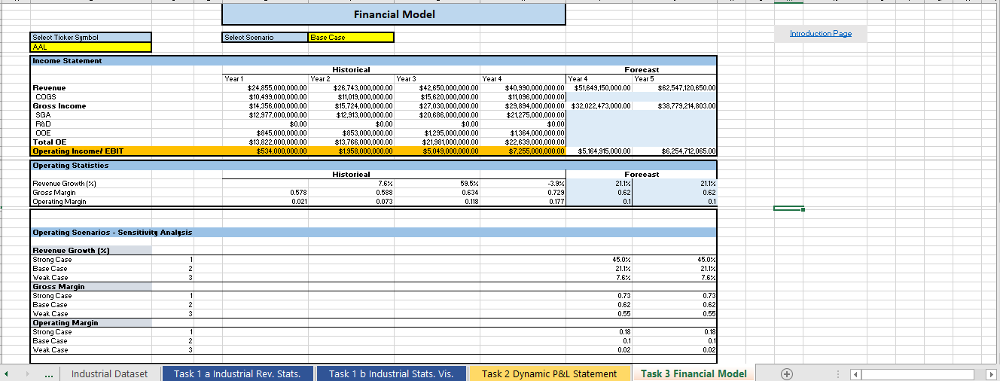

# NYSE Business & Data Analysis

## Introduction
In this project I analyzed real life data from New York Stock Market Exchange.  I drew a subset of a large dataset provide by Kaggle on [New York Stock Exchange](https://www.kaggle.com/dgawlik/nyse) that contains historical financial data. Next, I went through the process of calculating summary statistics, drawing an inference from the statistics, calculating business metrics and using models to forecast future growth prospects for the industrial sector companies. I performed that by:

- Interpreting the measures of central tendency and spread (mean, median, standard deviation, range.)

- Using a combination of Excel or Google Sheets functions (e.g., IF statements, INDEX and MATCH, calculating descriptive statistics with the IF statement, drop downs, data 
validation, VLOOKUP).

- Analyzing and forecasting financial business metrics using Excel.

- Visualizing of the business metric (Revenue) and using Excel charts to make financial model.

## Tasks Summary

### Tasks 1 Summary (Providing general statistics metrics and frequecy distributions for the revenue of the years 2012 to 2016)
- Divided the industrial sector dataset based on the year of ending.
- performed a statistical analysis on each year's dataset to show the mean, median, standard deviation. Variance, kurtosis, skewness, range, maximum, minimum, first qurtile, third quartile, range and inter-quartile range.
- Visualized the distribution of the datasets in the  form of histogram and box-plot to show the difference in distribtuion between the dataset.

\

### Task 2 Summary (Building dynamic and interactive P & L Statement for each and every company)
- Built a dynamic and interactive P&L Statement dashboard that shows the business metrics of Revenue Growth, Gross Margin, and Operating Margin in 4 years for each and every company.

### Task 3 (Constructing financial business model to forecast the business metrics)
-  Built up  a business model to forecast the Revenue Growth, Gross Margin and Operating Margin for the 2 years.
-  Calculated the Revenue, Gross Income and Operating Income using the forecast business metrics.

