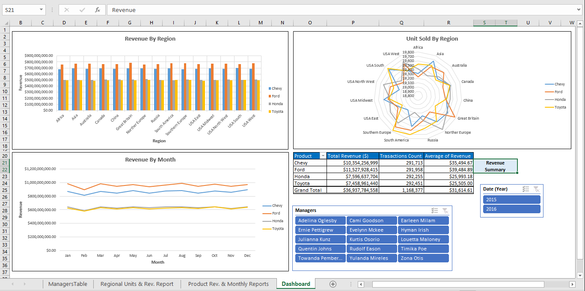
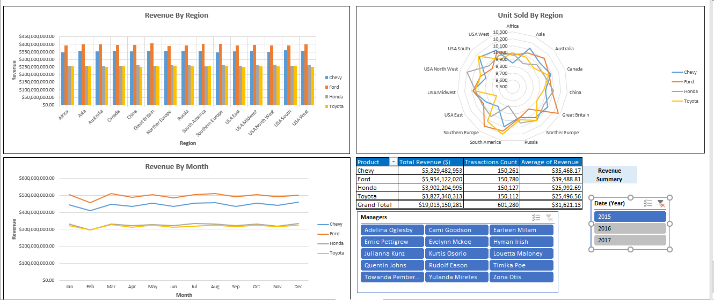

# Car Sales Revenue Analysis

\

## Introduction
The objective of this project was to build a self-service daynamic and interactive dashboard that provides a break down of the revenue for a cal sales company.I statrted this project an Excel table that included the names and regions of the managers (sales-persons) and 2 text (tsv) files that included the sales records for automobiles companies btw. the year 2015 and 2016 and then add the records for 2017. 

## Tasks Summary
In this project, I:

1- Imported the 2 text files into the #power_query and organized and combined them into 1 table named (SalesTextFiles) and automated the process of future import (updating).

2- Loaded the new table into the #data_model from the power query.

3- Loade the Excel tables named (managers) into the data model and joined with the (SalesTextFiles).

4- Generated pivot tables from the data model that summarized the business metrics such as Regional Units, Regional Revenue, Product Revenue and Monthly Revenue  with different slicers for filtering.

5- Visualized the values of the metrics in a range of Excel charts.

6- Arranged the Excel charts in a self-service dynamic and interactive dashboard.

7- Added new flat file to the folder and automated the process of updating the dashboard.

