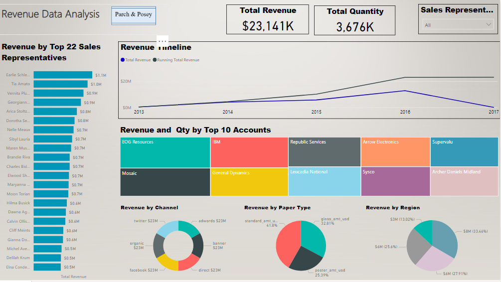

# Parch & Posey Revenue Analysis

## Intro:
This project for analyzing the revnue of Parch & Posey's which an imaginary company that sells 3 types of papers. To coduct this project, I downloaded the dataset as a PosgreSQL database file, then I used PG Admin to query and extract the tables as a csv files. Next, I loaded the dataset into Power BI built the dashboard

## OBJECTIVES
