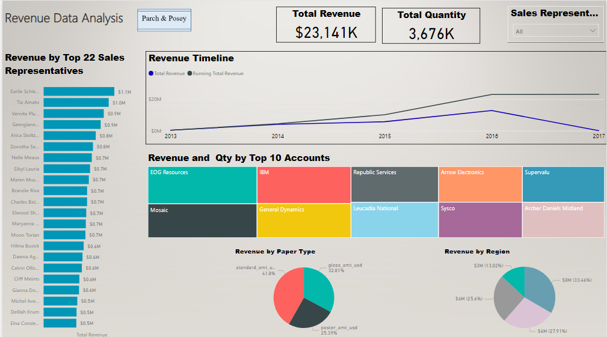

# Parch & Posey Revenue Analysis

## Intro:
This project for analyzing the revnue of Parch & Posey's which an imaginary company that sells 3 types of papers. To coduct this project, I downloaded the dataset as a PosgreSQL database file, then I used PG Admin to query and extract the tables as a csv files. Next, I loaded the dataset into Power BI built the dashboard which is supposed to address the Sales & Marketing Department business questions

## Objectives:
1- To show the __total revenue__ and __total quantity Sold__.\
2- To show the __revenue timeline__.\
3- To show the __top 10 accounts in term of Revenue__.\
4- To show a __revenue break down__ by __Channle__, __Paper Type__ and __Region__.\
5- To the __top 22 sales representatives__ in term of revenue.

## Data Scource:
5 csv files which contains the tables of orders, accounts, web events, regions and sales representatives.

## Tasks:
In this project, I \
1- Loaded the csv files into the Power BI.\
2- Cleaned and organized the data.\
3- Built a multi-tables data model.\
4- Used DAX to calculated business measures.\
5- Built a self-service dynamic and responsive dashboard.
