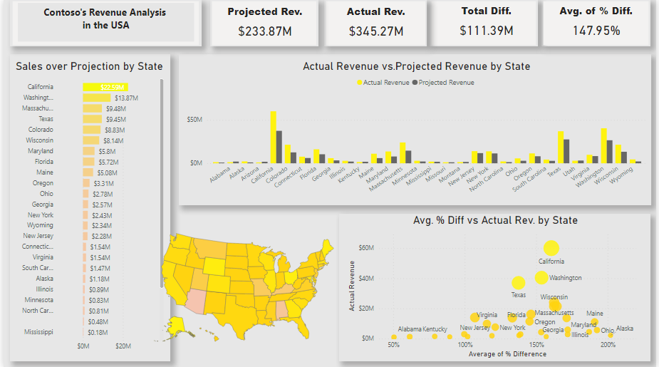

# Contoso's Revenue Analysis (in USA)

## Intro:
Thisproject is for analyzing and comparing the actual revenue vs. the projected revnue for Contoso sales in the USA. Contoso is The Contoso Corporation is a multinational business with its headquarters in Paris. The company is a manufacturing, sales, and support organization with more than 100,000 products.

## Objectives:
- To compare and contrast the actual revenue vs. the projected revenue for several states in USA.
- TO show the difference between the actual revenue and the projected revenue in $ for several states in USA.
- To the shw the relationship between the actual revenue, the projected revenue and the difference between them (in percentage) for several states in USA.

## Data Scource:
3 csv files and 1 html file.

## Tasks:
1- Connected Power BI to the data sources and loaded the data into the Power Query.\
2- Cleaned and organized the data by performing multiple tasks including appending and merging tables.\
3- Calculated business metrics using DAX.\
4- Visualized the analysis findings in variety of dynamic visuals.

