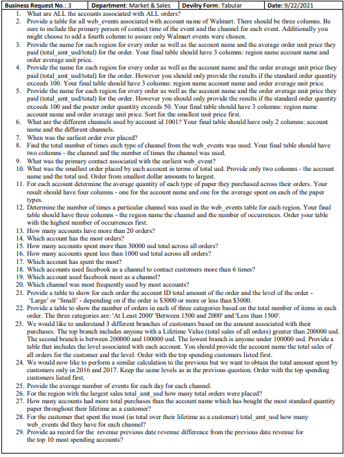
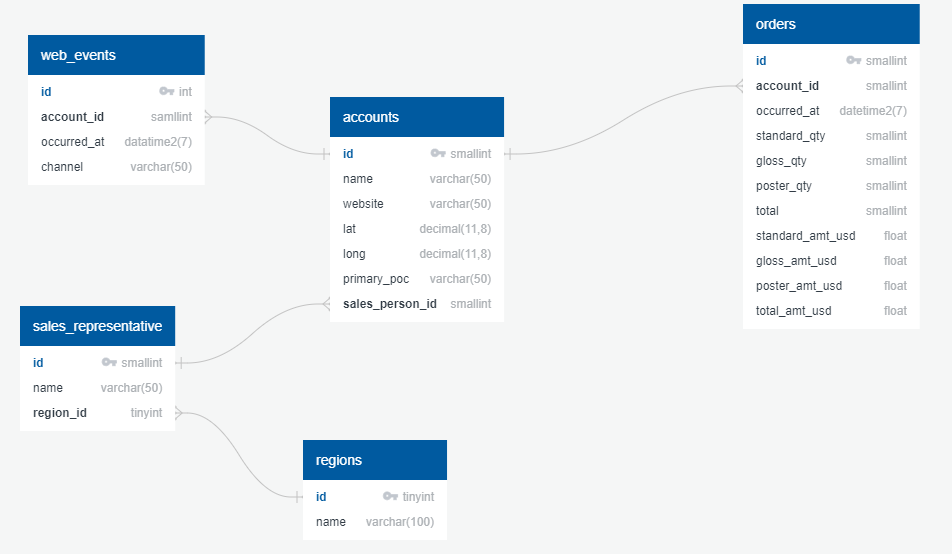

# Parch & Posey Data Analysis
_____
## Intorduction
Scenario:
I have received a business request from the Sales & Marketing Department in Parch & Posey (an imaginary company that sells papers). The business request contains multiple questions. To answer those questions, I analyzed the Parch & Posey dataset which consists of 5 csv file for the tables of __order__, __accounts__, __web_events__, __sales_representatives__ and __regions__.

## Project Planning and Specifications
### Porject Stages
1- __Data Collection__:
  Get the required dataset and upload it into MS SQL Server.
 \
2- __Data Preparation__:
  Transform the data as required and make sure it is ready for analysis.
\
3- __Data Analysis__:
  Write queries using T-SQL and use multiple condidtions and techniques to answer the business questions.
\
4- __Findings Conveying__:
  Send the answers of the business questions in the form of csv files (tabular form) to the corresponding department.
\
5 - __Project Documentation__:
  Document the project by storing the queries in a special database for potential futrue use.

### Project Specifications:
__Database__: Parch & Posey.
\
__Database Management System__: MS SQL Server.
\
__Database Management Tool__: SQL Server Management Studio.
\
__Programming Language__: T-SQL

### Business Request

## Data Collection
In this satge, I:
- Established the database Parch & Posey and imported the 5 csv files into it using SSIS.
- Examined the data within the SQL Server tables to make sure it it is as inten .

## Data Preparation
In this stage, I:
- Examined the relationship between the tables.
- Made sure that each column is of a suitable dat type.
- Made sure that the data fit the analysis.

## Data Analysis
In this stage, I used T-SQL and MS SQL Server Management Studio to query the tables and answer the business question. I used various techniques for the analysis including:
- Filtering.
- Joining.
- Grouping.
- Sorting.
- CTE & Sub-queries.
- Date, Math and Text Functions.
- Window Functions.

## Conveying of Findings
In this stage, I forwarded the results of the anaysis as csv files to the Sales & Marketing Department.

## Project Documentation
In this stage, I documented the project by establishing the documentaion database *Business requests* which is dedicated to show and document each and every question every business request. Project documentation is important for two reasons:
\
1- To ensure and emphasize the job responsibilities and roles.
\
2- To facilitate answering or automating the answering process if the main database is loaded incrementally and the same questions are asked regularly. For example, the data analyst can use SSIS to execute SQL Tasks that query the documentation database for certain questions and store the results in variables or flat file. Next, the data analyst can add a data flow tasks to query the main database using the results stored in a variable or flat files, then store the final results in a flat files. Next, the data analyst can add a system tasks to move the files into the desired location. This can be automated and scheduled to be executed regularly

